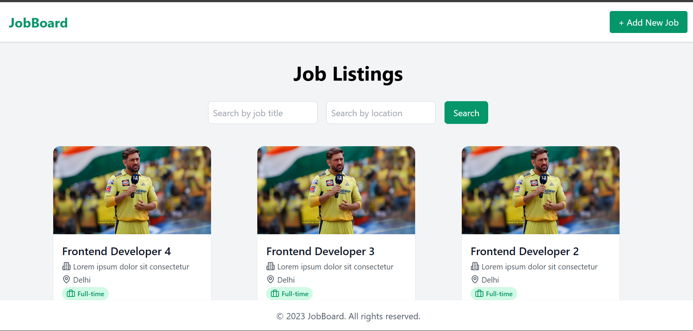
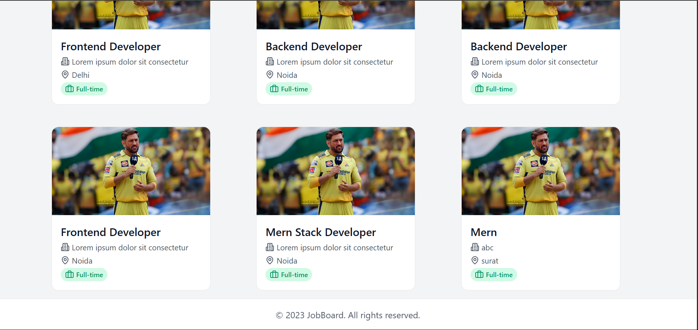
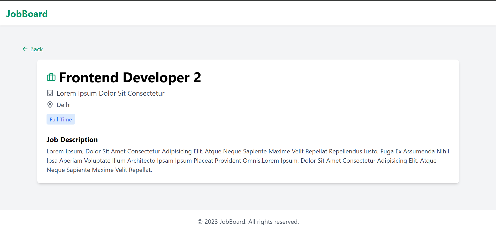
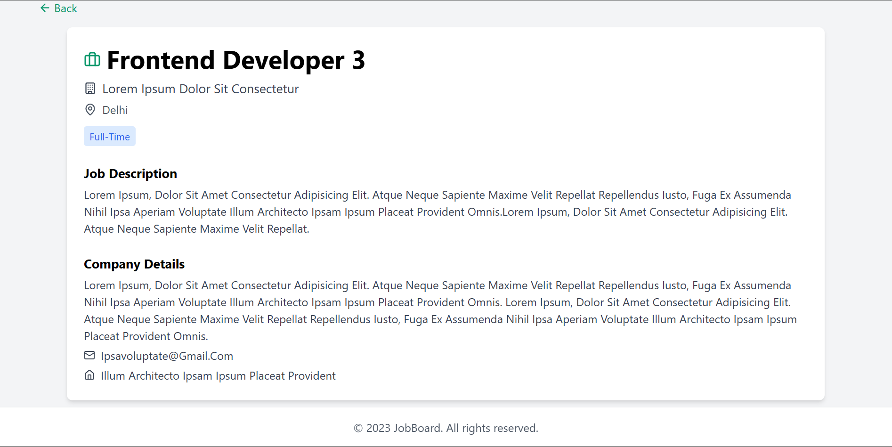

# 💼 Mini Job Board

A full-stack **Job Board** web application built with modern technologies on both frontend and backend.

---

## 🧰 Tech Stack

- **Frontend**: Vite + React + Tailwind CSS
- **Backend**: Node.js + Express
- **Database**: MongoDB

---

## 🌐 Live

[Backend Link](https://mini-job-board-ime2.onrender.com)

---

## 📁 Project Structure

- ├── **client/** # Frontend (Vite + React + Tailwind CSS)
- └── **server/** # Backend (Node.js + Express)


## 🚀 Getting Started

### 🔷 Client Setup (Frontend)

```bash
cd client
npm install
add .env file
    VITE_API_BASE = http://localhost:5000/api/jobs
npm run dev

```
### 🔷 Server Setup (Backend)

```bash
cd server
npm install

add .env file
    PORT=5000
    MONGO_URI=mongodb://localhost:27017/mini_job_board

node server.js
```

## 📸 Preview




